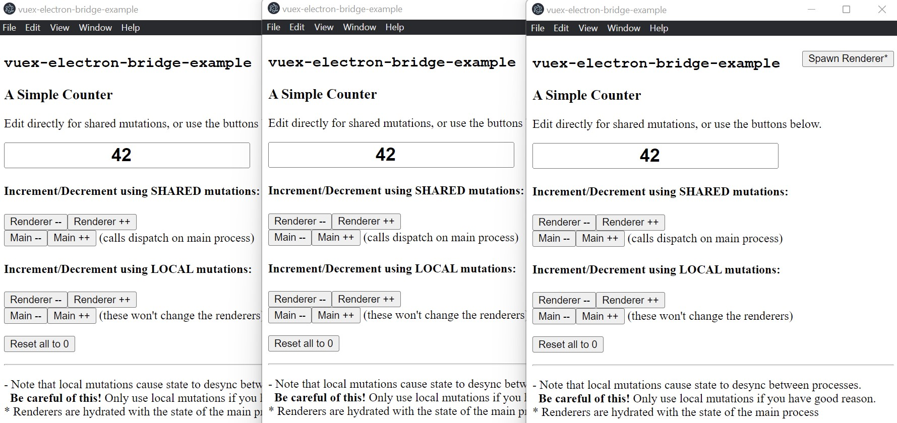

# Vuex Electron Bridge Example

A simple Electron+Vue app demonstrating usage of [Vuex Electron Bridge](https://github.com/akett/vuex-electron-bridge)



## Where to look

1. src / [electron.js](./src/electron.js)

- At the top, note the usage of `createBridge()`
- A little down, find `createWindow` to see the `webPreferences`
- At the bottom, note the usage of `unmount()`

2. src / [preload.js](./src/preload.js)

- A single call to `exposeBridge()` is all that's required.

3. src / [store.js](./src/store.js)

- See the plugin added to store.
- Note how Shared vs. Local mutations are handled, I used additional types to clearly designate actions that
  call `localCommit`.

## How to run

```
# In your terminal, clone the repo and cd in.
git clone https://github.com/akett/vuex-electron-bridge-example.git
cd vuex-electron-bridge-example

# Install dependencies (npm or yarn)
yarn install

# Run the app
yarn serve
```

## How to use

- Spawn a few extra windows with the "Spawn Renderer" button.
- Type directly in the input - it uses a shared mutation that sets the counter value, rather than increment/decrement.
- The SHARED buttons will have no visible difference, but under the hood the SHARED Main buttons simply
  call `store.dispatch` on the main process instead of on the renderer. This can be useful if you have code (either
  inside or outside your store) that must only execute on the main process.
- The LOCAL Renderer buttons will only change the renderer state.
- The LOCAL Main buttons will only change the main process state. (look at your terminal to see what's going on.)
- Re-sync processes by typing in the input or clicking the "Reset all to 0" button.

## Play with it

Try to understand the consequences of each approach (Shared vs. Local, Renderer vs. Main, Increment/Decrement vs. Set).

- See what happens when you spawn another renderer after using the LOCAL buttons.
    - *the new renderer inherits the main process state*
- See what happens if you use the SHARED buttons after using the LOCAL renderer buttons.
    - *you'll see the renderers increment/decrement their own state, but they'll be desynced!*
